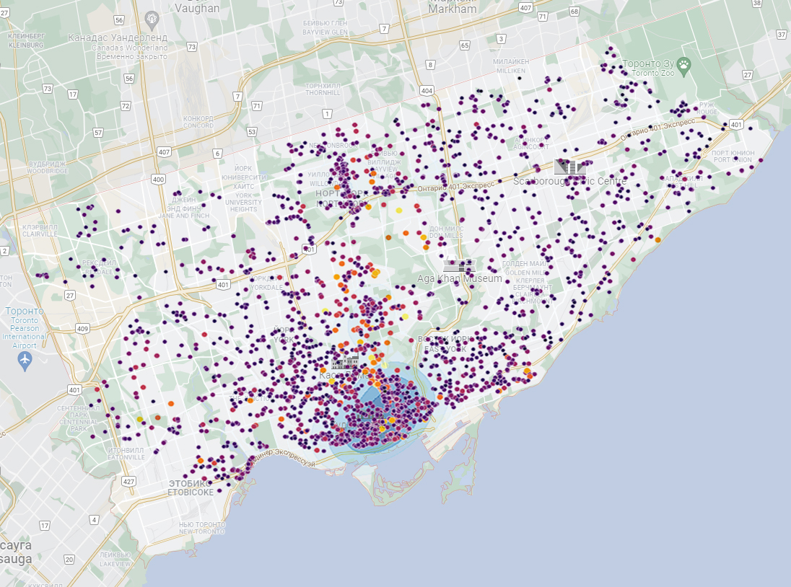

# 
Zillow Data Scraping and Analyzing

<a href="https://www.zillow.com/" title="Zillow">Zillow</a> is a service to buy, sell or rent a real estate and is being widely used in USA and Canada. The main page offers an input to type a city name to search property in. Current scraping and analyzing example is based on renting real estate in Toronto, ON.

Since Zillow doesn't show all offers at once and requires to zoom in (and if shows, only 20 pages are available), it is required to switch to an **Inspect mode** in your browser, move along all the map to download data in your browser (don't forget to zoom in to download as much data as you can), and click on download ``.har`` file. 

The ``.har`` file is being parsed using <a href="https://stevesie.com/apps/zillow-api" title="zillow-api">this webpage.</a> After it is done, download all raw responses into ``./scraping/responses`` folder in this repo. We are now ready to start scraping!

Before running script, make sure you have installed all libaries needed:

    pip install -r requirements.txt

<h1>Data Scraping</h1>

To start scraping process, simply type in console:

    python ./scraping/scrape.py

After the script is done, <a href="https://github.com/arthurkazaryan/zillow/blob/main/scraping/data.xlsx" title="an-excel-file">an excel file</a> is being created with all collected data (no personal data such as e-mail addresses or mobile phone numbers are collected. Correct the script if needed).

As for current scraping process of renting real estate in Toronto, 4838 offers were collected.

<h1>Data Analyzing</h1>

When the excel file ``./scraping/data.xlsx`` is available, run the following script which outputs five images containig bar plots and scatter plots:

    python ./analyzing/analyze.py

<h2>Real estate pricing</h2>

Prices are divided into several categories - C$0-2000, C$2000-4000, C$4000-6000, C$6000-8000, C$8000-10000.

Amount of offers in each category.

About 67% offers prices are in range of C$2000-4000.

<h2>Correlation matrix</h2>

To find out the best correlations between each column's data, we will build and analyze the correlation matrix.

Since the columns in dataframe containing numeric values are only Latitude, Longitude, Bedrooms, Bathrooms and price, only them are shown in correlation matrix.

Correlation matrix.

Here we can see that the amount of bathrooms affects the price more than the amount of bedrooms.

<h2>Number of total offers.</h2>

After we found out that the price depends on the amount of bedrooms and bathrooms the property has, lets build a graph which shows the mean price for each amount for bedrooms and bathrooms:

Mean prices of each amount of bedrooms and bathrooms.

The more bedrooms and bathrooms the real estate has, the more expensive it is.

Lets see how many offers we have for each amount of bedrooms and bathrooms:

Amount of offers containing certaing amout of bedroms and bathrooms.

Mostly offers contain one or two bedrooms and bathrooms. More than two are rare.

<h2>Scatterplot</h2>

Having X and Y coordinates for each offering we can build a scatterplot showing the concentration in each discrict and the price range (scatterplot shows only real estate with price less than C$10000/mo).

The most amount of real estate for renting is located in downtown. Also, the vast majority of properties located in north-east and west parts of Toronto are less than C$4000/mo.
